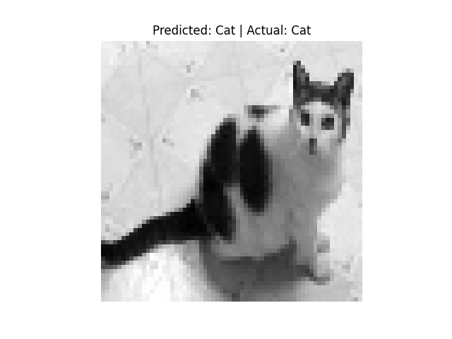
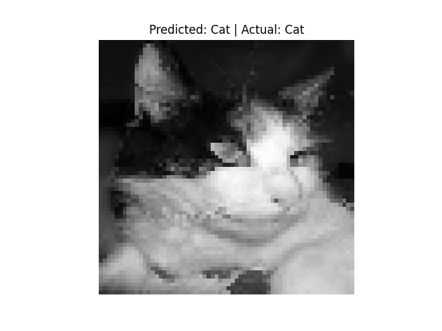
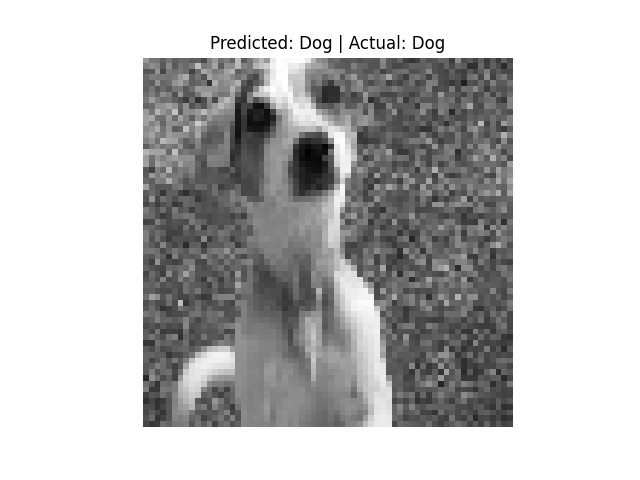
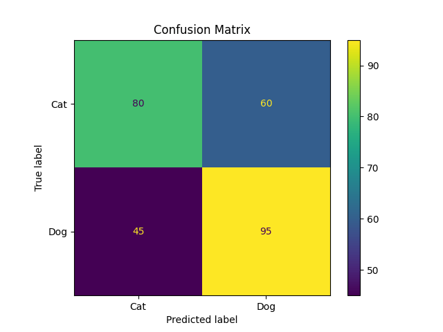

# 🐶🐱 Dog vs Cat Image Classifier using SVM

A Machine Learning based Image Classification project that classifies images as **Cat** or **Dog** using the **Support Vector Machine (SVM)** algorithm.

---

# 🚀 Features

- ✅ Image preprocessing using OpenCV
- ✅ Resize images to fixed dimensions (64x64)
- ✅ Convert images into flattened feature vectors
- ✅ Train an SVM classifier
- ✅ Predict whether an image is a Cat or Dog
- ✅ Visualize prediction results using Matplotlib

---

# 🛠️ Technologies Used

- Python
- OpenCV
- NumPy
- Matplotlib
- Scikit-learn

---

# 📂 Dataset Structure

```bash
Dog-Cat-Classifier-master/
│
├── Data/
│   ├── Train_Data/
│   │   ├── cat/
│   │   └── dog/
│
├── output/
├── main.py
└── README.md
```


# ⚙️ Workflow
```bash
📂 Load dataset images using OpenCV
🖼️ Resize all images to 64×64
🔢 Convert images into flattened feature vectors
🏷️ Assign labels:

0 → Cat
1 → Dog

✂️ Split dataset into training & testing sets
🧠 Train SVM classifier using Scikit-learn
🔍 Predict image classes on test data
📊 Evaluate model accuracy
🖼️ Visualize prediction results using Matplotlib
```
# 📊 Model Accuracy
```bash
Model Accuracy: **54.28%**
###Accuracy may improve with:
-More training data
-Better preprocessing
-Deep Learning models like CNN
```

# 🖼️ Sample Prediction Output





# 📌 Confusion Matrix


# ▶️ How to Run the Project
##Step 1: Install 
```bash
pip install numpy matplotlib opencv-python scikit-learn
```
##Step 2: Run the Program
```bash
python main.py
```

# 📚 Learning Outcomes
```bash
Through this project, I learned:
- Basics of Image Classification
- Image preprocessing techniques
- Feature extraction
- Working with SVM
- Model training & testing
- Data visualization
```

# 🔮 Future Improvements
```bash
✨ Improve accuracy using CNN
✨ Add real-time image prediction
✨ Build GUI/Web App
✨ Use larger datasets
```

# 👩‍💻 Author
Yashi Rohara
```bash
Aspiring Software Developer passionate about:
Machine Learning
Computer Vision
Real-world AI Projects
```